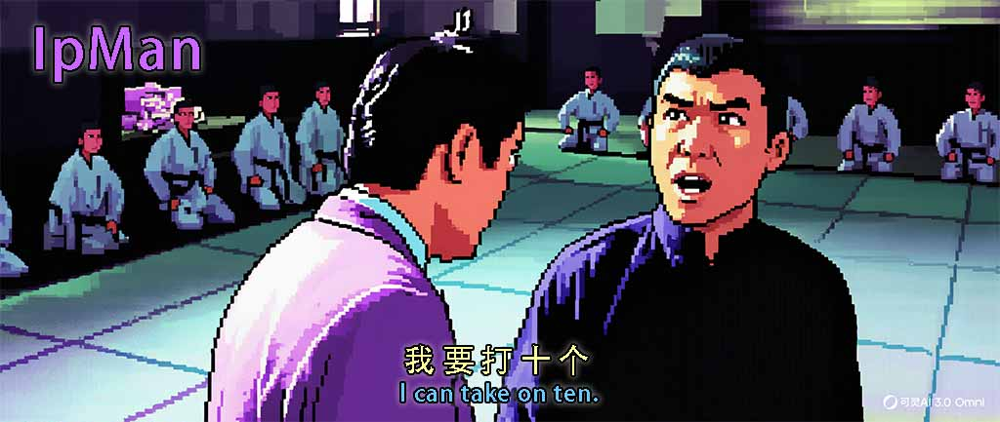

  

# IpMan - Intelligence Package Manager

*I can take on ten.*

> Agent skill virtual environment manager — like conda/uv, but for AI agent skills. With built-in defense against malicious skills.

## What is IpMan?

IpMan manages AI agent skills the way conda/uv manages Python packages — with isolated environments, dependency resolution, and a community registry. But unlike traditional package managers, IpMan includes a **security-first risk assessment engine** that protects you from the growing threat of malicious agent skills.

## Key Capabilities

- **Virtual Environments** — Isolated skill sets per project, user, or machine
- **Risk Assessment** — Every skill scanned for credential theft, data exfiltration, obfuscated code
- **Security Modes** — Four levels from PERMISSIVE to STRICT
- **IP Packages** — Bundle and distribute skill collections as `.ip.yaml` files
- **IpHub** — Community registry with search, publish, and threat reporting
- **Agent Agnostic** — Claude Code, OpenClaw, and more via adapter plugins

## Quick Links

- [Installation](getting-started/installation.md)
- [Quick Start](getting-started/quickstart.md)
- [CLI Reference](cli-reference.md)
- [Security Guide](guide/security.md)
